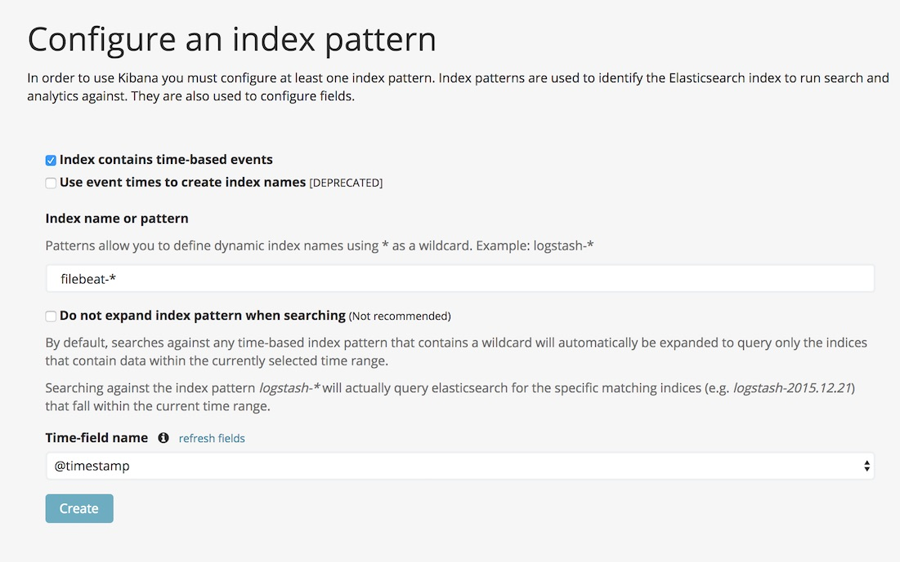

# Automated ELKStack provisioning with Vagrant

ELK Stack automated setup with ELK Stack Server and Client

### Requirements

To run the test setup, please make sure the following software is installed on your system:

1. Vagrant
2. VirtualBox
3. vagrant-vbguest and vagrant-scp plugins:

		vagrant plugin install vagrant-vbguest
		vagrant plugin install vagrant-scp

4. 8GB of RAM on Workstation/Laptop running the setup

### Provisioning

* Clone the repository:
    
        git clone https://github.com/vitativ/elasticsearch.git

* Go to elasticserach directory: 

        cd elasticsearch

* Start up and provision both the server and the client: 

        vagrant up

### Update client configuration

* Get logstash certificate from the server:

		vagrant scp server:/etc/pki/tls/certs/logstash-forwarder.crt .

* Upload logstash certificate to the client:

		vagrant scp logstash-forwarder.crt client:/tmp/logstash-forwarder.crt

* Prep logstash certificate on the client:

		vagrant ssh client
		sudo cp /tmp/logstash-forwarder.crt /etc/pki/tls/certs/logstash-forwarder.crt
		sudo systemctl restart filebeat

### Update Kibana Configuration

* Go to [http://localhost:8080/](http://localhost:8080/). Use `admin/kibana` credentials
* Create a new default index `filebeat-*`, choose @timestamp in time field name and click on the **Create** button.

###  Verify logs

* Run logger bomber:

		vagrant ssh client
		sh /vagrant/logger_bombing.sh
		
* Got back to [http://localhost:8080/](http://localhost:8080/) and verify that logs are available
